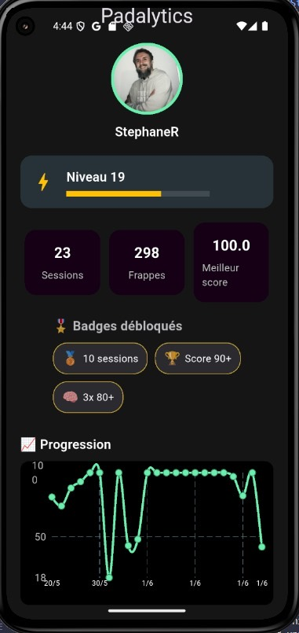
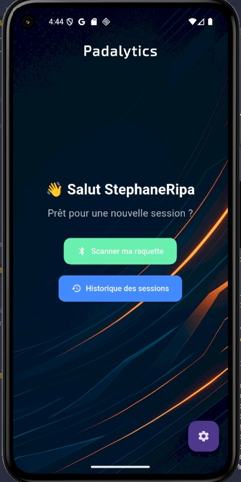

# 🎾 Padalytics – L'analytique de performance au service du padel

**Padalytics** est une application mobile connectée à une raquette liée à un capteur, permettant aux joueurs de padel de suivre leurs performances en temps réel. Grâce à un capteur embarqué, l'app analyse les frappes, la vitesse, les types de coups et fournit des feedbacks visuels engageants.

> 🚀 **Statistiques. Progression. Motivation.**  
> Padalytics, c'est le coach qui tient dans votre poche. et une App qui apprend de vos sessions

---

## 📱 Fonctionnalités clés

- 📊 **Analyse des sessions** : nombre de frappes, vitesse moyenne, durée, répartition des coups droits/revers, zone d’impact.
- 🧠 **Score de performance** : calculé en temps réel pour évaluer l’intensité et la régularité.
- 🏅 **Badges & XP** : système de récompenses pour gamifier l'entraînement.
- 📈 **Graphiques de progression** : suivez vos stats dans le temps.
- 📤 **Partage des sessions** : export visuel de vos meilleures performances.

---

## 📸 Aperçu de l'application

| Profil utilisateur | scanne et historique | login |
|--------------------|------------------|------------|
|  |  |  |

> *(Les visuels sont des maquettes – projet en développement actif.)*

---

## 🔒 Code source privé

Le code complet de Padalytics est actuellement en **repo privé**, dans le cadre d’un développement produit.  
Si vous êtes investisseur, partenaire tech ou intéressé par le projet, n'hésitez pas à me contacter.

---

## 🧠 Stack technique

- Flutter (mobile cross-platform)
- Firebase (Auth, Firestore, Storage)
- BLE (Bluetooth Low Energy)
- Chart, animations, custom UI
- Capteur inertiel BLE

---

## 📩 Contact

- 📬 srdevlop@gmail.com
- 💼 www.linkedin.com/in/stephripa
- 🌍 padalytics.com

---

> Made with ❤️ for padel players by a passionate dev.
